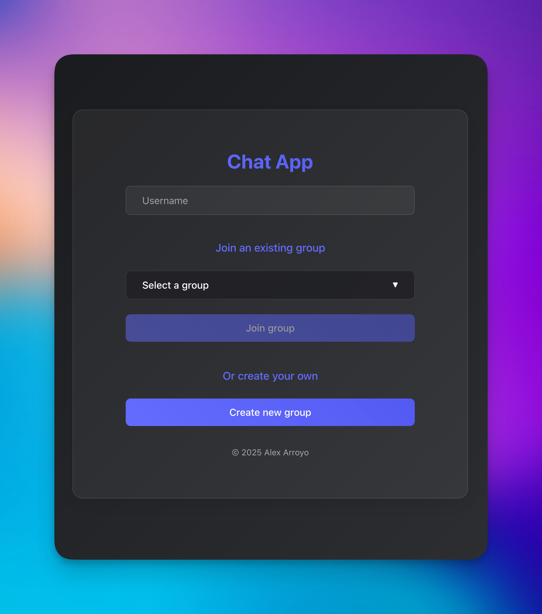

# 💬 Chat App

This is a real-time, full-stack chat application built as part of a take-home assignment.



## Tech Stack

### Frontend
- **Svelte** (Vite)
- CSS3 (custom, responsive, dark/light mode)
- Socket.IO Client

### Backend
- **Node.js + Express**
- Socket.IO Server
- TypeScript

### Testing
- **Vitest** – Unit testing (backend)
- **Playwright** – End-to-End testing (frontend)

---

## eatures Implemented

- Real-time messaging via WebSockets
- Group creation and joining
- UI supports dark and light modes (responsive to OS)
- Max character limit (200) per message
- Group-specific message visibility
- Clear UI with dropdown group selector and animation
- Two full tests:
  - **1 unit test file** covering message handling and validation
  - **1 E2E test** simulating two clients chatting

---

## How to Run

### 📦 Clone this repo

```bash
git clone https://github.com/alexaldearroyo/chat-app.git
cd chat-app
```

### 🖥 Start the Backend

```bash
cd server
npm install
npx tsx index.ts
```
- Backend server will be available at:
http://localhost:3000


### 🌐 Start the Frontend

```bash
cd client
npm install
npm run dev
```
- Frontend will be available at:
http://localhost:5173

### 🧪 Run tests

#### Backend unit tests (Vitest)
```bash
cd server
npx vitest run
```

#### Frontend E2E tests (Playwright)
```bash
cd client
npx playwright test
```
---

## Requirements
- Node.js 18+
- npm
- Ports 3000 (backend) and 5173 (frontend) must be free

---

## TODOs
- Group deletion (server/client)
- Duplicate group/username checks
- Message history
- Connected user list
- Leave group button
- Timestamp display
